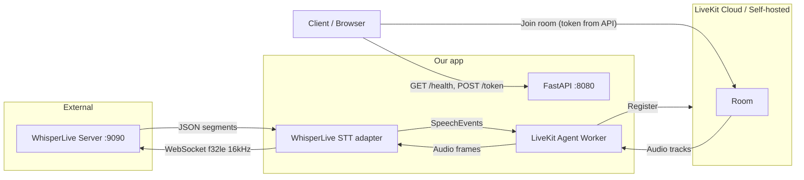

# WhisperLive + LiveKit + FastAPI POC (uv)

## Current state

- Workspace is effectively empty (only [LICENSE](LICENSE) and [.gitignore](.gitignore)).
- No existing Python app or dependencies.

## Architecture

- **WhisperLive** (collabora): Runs as a **separate process** (user starts it; documented in README). Listens on port 9090, WebSocket protocol: client sends config JSON then binary f32le PCM 16 kHz; server responds with JSON `segments` / `status` (e.g. `SERVER_READY`).
- **Our app**: One codebase, two runnable modes (can be one or two processes for POC):
  - **FastAPI**: Health and token endpoints (and optionally a simple transcribe endpoint for testing).
  - **LiveKit agent worker**: Connects to LiveKit, joins rooms, uses a **custom STT** that forwards room audio to WhisperLive and turns responses into LiveKit `SpeechEvent`s.

## 1. Project setup (uv only)

- **Initialize**: `uv init --app` in the project root (creates [pyproject.toml](pyproject.toml) and a small app layout).
- **Dependencies** (all via `uv add`, no pip):
  - **FastAPI + server**: `fastapi`, `uvicorn`.
  - **LiveKit**: `livekit-agents`, `livekit-api` (token creation).
  - **WhisperLive client**: `whisper-live` (provides the WebSocket protocol and optional use of its `Client` or we reimplement a minimal async client).
  - **Audio**: LiveKit agents and `whisper-live` use 16 kHz; agent frames may be 24 kHz — add a small resampling dependency (e.g. `numpy` + `scipy` or `soundfile` for resample). Prefer minimal (e.g. `numpy` only and simple resample or use a small lib).
- **Layout**: Single package or flat modules under `src/` or project root (e.g. `app/` or `src/whisperlivekit/`) with clear entrypoints for API and worker.

## 2. WhisperLive integration (client side)

- **No pip**: All install/run via uv; document that WhisperLive server must be running (e.g. `python run_server.py --port 9090 --backend faster_whisper` from a separate clone/venv, or `pip install whisper-live` there).
- **Protocol**: Connect to `ws://<host>:9090`, send config JSON (`uid`, `language`, `task`, `model`, `use_vad`, etc.), then stream binary f32le 16 kHz chunks; on `SERVER_READY` start sending; parse `segments` and optional `status` from server.
- **Async**: `whisper-live`’s `Client` is sync (threading). For the agent, prefer a **minimal async WebSocket client** (e.g. `websockets` library) that:
  - Sends config on connect.
  - Exposes a method to push audio bytes (f32le 16 kHz).
  - Parses incoming JSON and yields transcription segments (and maps to final vs interim if the server sends such).

This keeps the agent event loop single-threaded and avoids blocking.

## 3. Custom LiveKit STT (WhisperLive adapter)

- **Interface**: Implement the LiveKit STT contract used with `AgentSession`: provide a `stream()` that returns a stream accepting `push_frame(rtc.AudioFrame)` and emitting `SpeechEvent` (e.g. `FINAL_TRANSCRIPT`, `INTERIM_TRANSCRIPT`).
- **Audio path**: Incoming frames are typically 24 kHz (or as per LiveKit docs). Resample to 16 kHz and convert to f32le, then send to the WhisperLive WebSocket client.
- **VAD / buffering**: Whisper is not natively streaming. Use LiveKit’s **StreamAdapter** + **Silero VAD** (as in [LiveKit STT docs](https://docs.livekit.io/agents/v1/integrations/stt/)): VAD buffers until end-of-speech, then our adapter sends that buffer to WhisperLive and maps returned segments to `SpeechEvent`s. So: `StreamAdapter(whisperlive_stt, vad.stream())` and the inner `whisperlive_stt` implements the STT interface that receives VAD-segmented audio and talks to WhisperLive.
- **Connection lifecycle**: One WebSocket connection per stream (or per room), open when stream starts, close when stream ends; handle `SERVER_READY` and errors.

## 4. LiveKit agent entrypoint

- **Worker**: Use `livekit.agents.AgentServer()` and register an RTC session (e.g. `@server.rtc_session(agent_name="whisperlive-transcriber")`).
- **Session**: Create an `AgentSession` with **STT only** (no LLM/TTS for POC): `stt=StreamAdapter(whisperlive_stt, vad.stream())`, and optionally no `agent` or a minimal agent that only reacts to transcription (e.g. log or publish transcript to room).
- **Credentials**: Read `LIVEKIT_URL`, `LIVEKIT_API_KEY`, `LIVEKIT_API_SECRET` from env (or .env) for the worker and for the FastAPI token endpoint.

## 5. FastAPI app

- **Endpoints**:
  - `GET /health`: Return 200 and simple JSON (e.g. `{"status": "ok"}`).
  - `POST /token`: Body (e.g. `room`, `identity`, optional `name`); create a LiveKit `AccessToken` with `VideoGrants(room=..., room_join=True)` and return `{"token": "<jwt>"}`. Use `livekit-api` and env credentials.
- **Optional (POC)**: `POST /transcribe`: Accept an audio file upload, send it to WhisperLive (via REST if WhisperLive is started with `--enable_rest`, or by opening a WebSocket and streaming the file). Keeps POC testable without a LiveKit client.

## 6. Running the POC

- **WhisperLive**: Document and (optionally) provide a one-liner or script to start it (e.g. in a separate terminal): `uv run python -m whisper_live.run_server` or external `run_server.py --port 9090 --backend faster_whisper`.
- **Our app**:
  - **Option A (recommended for POC)**: Two commands — `uv run uvicorn app.api:app` (or equivalent) for FastAPI; `uv run python -m app.worker` (or `agents run ...`) for the LiveKit worker. Two processes.
  - **Option B**: Single process that starts both (e.g. FastAPI lifespan starts the agent worker in a background thread/task). Simpler for “one command” but slightly more complex; optional for POC.
- **.env.example**: List `LIVEKIT_URL`, `LIVEKIT_API_KEY`, `LIVEKIT_API_SECRET`, and optionally `WHISPERLIVE_WS_URL=http://localhost:9090`.

## 7. Documentation

- **README**: How to install (uv only), set up .env, start WhisperLive, start API and worker, get a token, join a room with a LiveKit client (e.g. Meet or a minimal web sample), and see transcription (e.g. in agent logs or published to room). No pip usage.

## Key files to add

| Path                             | Purpose                                                                                                                                                    |
| -------------------------------- | ---------------------------------------------------------------------------------------------------------------------------------------------------------- |
| [pyproject.toml](pyproject.toml) | uv project, dependencies (fastapi, uvicorn, livekit-agents, livekit-api, whisper-live, websockets, numpy, scipy or similar for resample), optional scripts |
| `app/` or `src/`                 | Package root                                                                                                                                               |
| `app/api.py` (or `main.py`)      | FastAPI app: `/health`, `/token`, optional `/transcribe`                                                                                                   |
| `app/worker.py`                  | Agent entrypoint: `AgentServer`, rtc_session, AgentSession with WhisperLive STT                                                                            |
| `app/stt/whisperlive.py`         | Custom STT: WhisperLive WebSocket client (async), resample, map segments → SpeechEvents, StreamAdapter + VAD usage                                         |
| `app/stt/__init__.py`            | Export STT                                                                                                                                                 |
| `.env.example`                   | Env vars for LiveKit and WhisperLive URL                                                                                                                   |
| [README.md](README.md)           | Install (uv), run WhisperLive, run API + worker, test                                                                                                      |

## Dependencies summary (uv)

- `fastapi`, `uvicorn[standard]`
- `livekit-agents`, `livekit-api`
- `whisper-live`
- `websockets` (async WebSocket client for WhisperLive if we don’t use the sync client in a thread)
- `numpy` (and possibly `scipy` for resampling 24kHz→16kHz, or a small resampler)
- `python-dotenv` for .env
- Optional: `silero-vad` or use VAD from livekit-plugins (e.g. `livekit-plugins-silero`) if not bundled with livekit-agents

(Exact package names to be confirmed at implementation time; e.g. `livekit-plugins-silero` for VAD.)

## Out of scope for this POC

- Running WhisperLive inside the same process as the app (run separately).
- Diarization, translation, or multiple languages (can be added later via WhisperLive config).
- Production hardening (auth for /token, rate limits, TLS).
- Docker / Docker Compose (can be added later).
